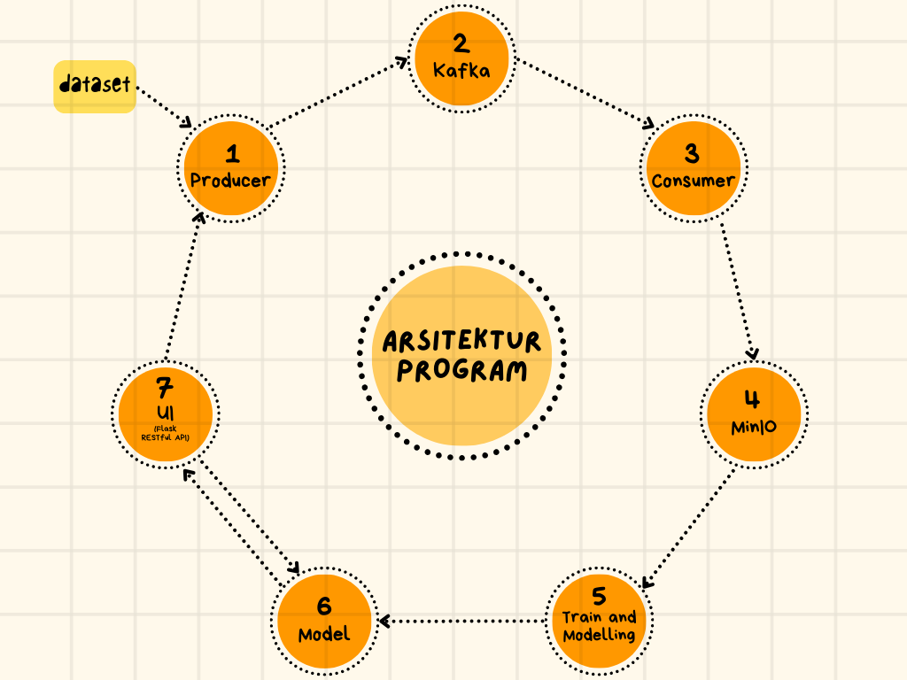
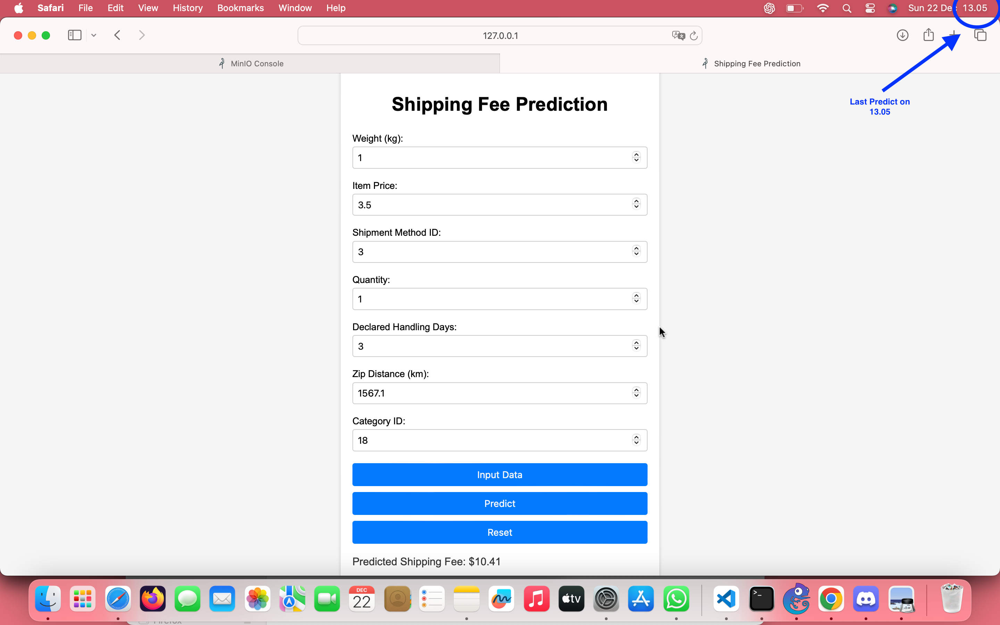
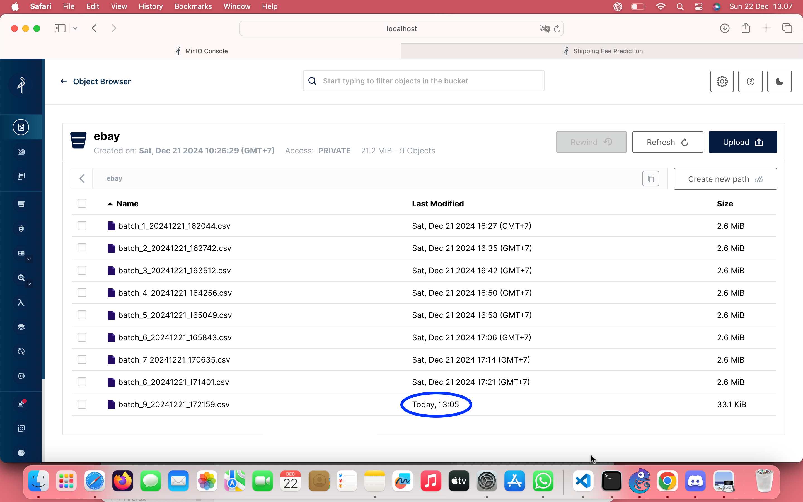
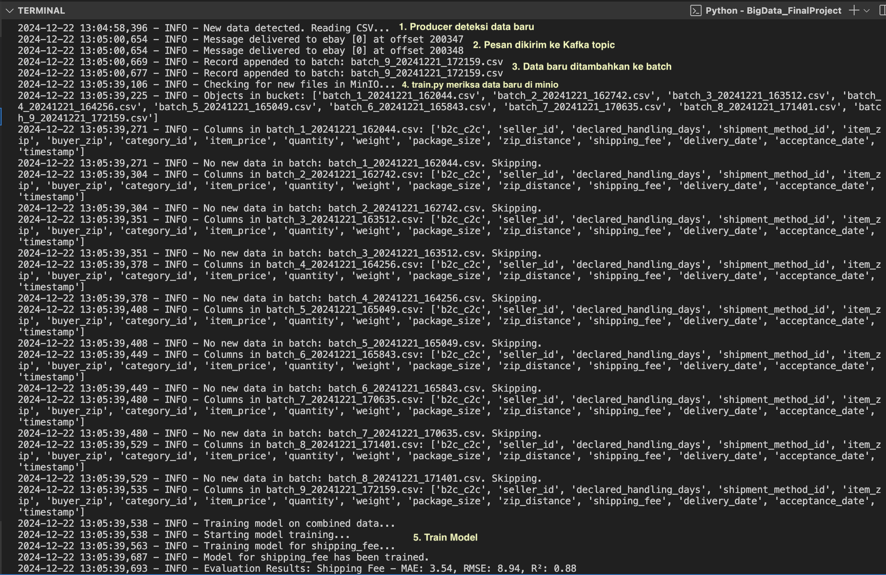
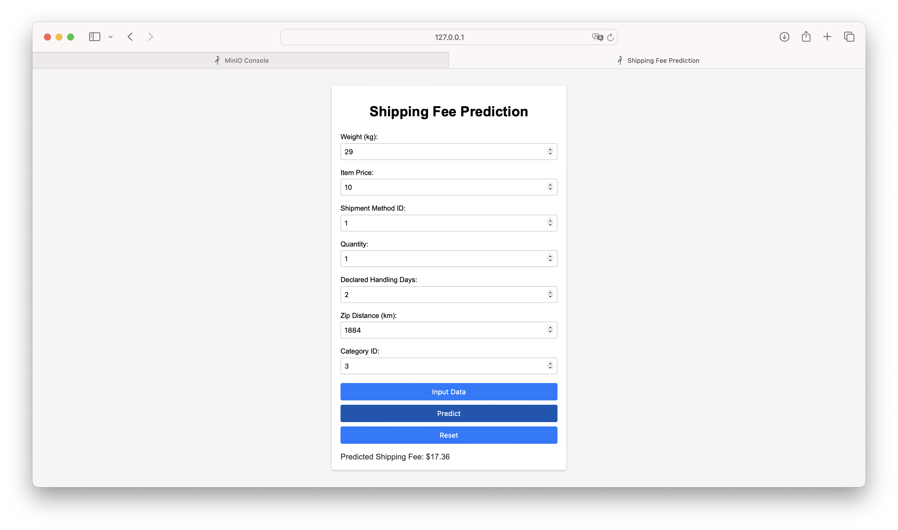
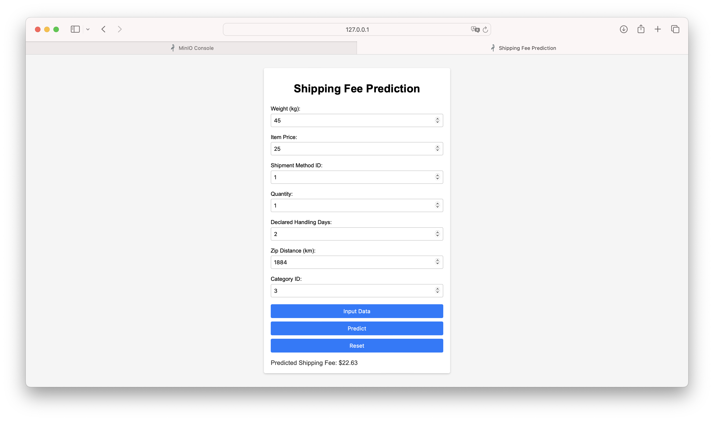
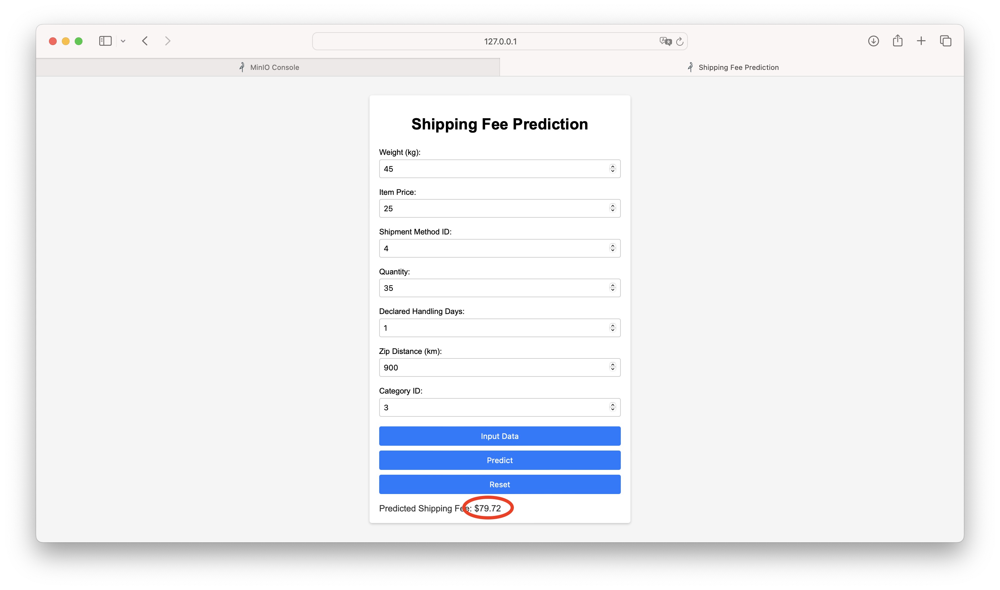
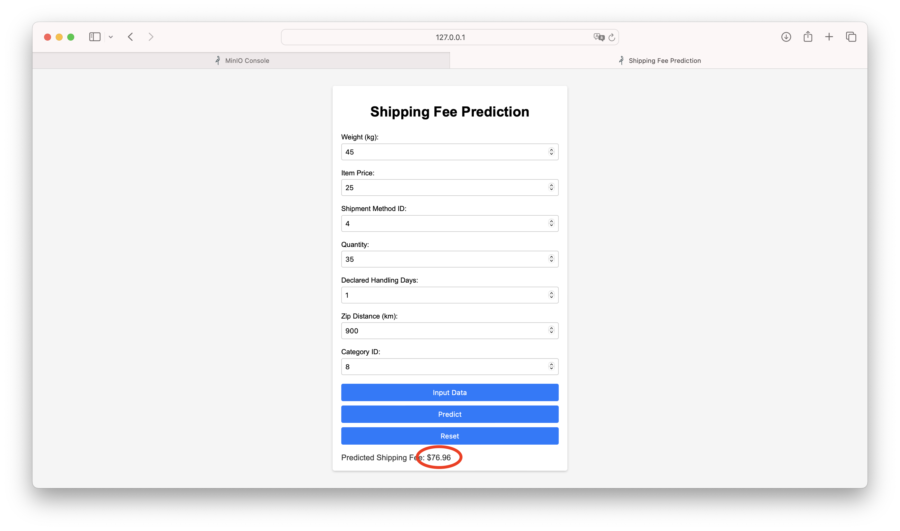

# Final_Project-Big_Data

|         Name            |    NRP     |
|-------------------------|------------|
| Muhammad Faishal Rizqy  | 5027221026 |
| Rafif Dhimaz Ardhana    | 5027221066 |
| Khansa Adia Rahma       | 5027221071 |


## Prediksi Biaya Pengiriman eBay


Proyek ini bertujuan untuk memprediksi biaya pengiriman menggunakan dataset dari [Kaggle: eBay Delivery Date Prediction](https://www.kaggle.com/datasets/armanaanand/ebay-delivery-date-prediction). Dengan memanfaatkan data historis pengiriman, model ini dirancang untuk memberikan estimasi biaya pengiriman yang akurat. Sistem ini juga dirancang untuk beroperasi secara real-time, memungkinkan pembaruan model yang otomatis dan responsif terhadap perubahan dalam dataset.

## Fitur Utama
- Prediksi Biaya Pengiriman: Model ini mampu memprediksi **shipping fee** berdasarkan data yang diberikan.
- Pengolahan Data Real-time: Menggunakan arsitektur yang efisien untuk **memproses data secara real-time**.
- Otomatisasi Pembaruan Model: Proses pelatihan dan pembaruan model dilakukan secara otomatis saat data baru tersedia, memastikan **model selalu menggunakan data terupdate**.

## Arsitekur


## Work Flow
- Pengambilan Data:
    - Producer memeriksa dataset CSV secara berkala untuk mendeteksi adanya pembaruan. Jika ada data baru, Producer akan mengirimkannya ke Kafka.
- Pengolahan Data:
    - Kafka topic akan menerima data dari Producer.
    - Consumer akan mengambil data baru dari Kafka dan menyimpannya di MinIO.
- Pelatihan Model:
    - Skrip Python yang menjalankan pelatihan model akan memeriksa keberadaan data baru di MinIO setiap 5 menit.
    - Jika data baru terdeteksi, proses Train and Modelling akan dilakukan untuk memperbarui model dengan data terbaru.
- Prediksi Real-time:
    - UI (antarmuka pengguna) selalu menggunakan model terbaru untuk memprediksi biaya pengiriman. Pengguna dapat mengakses prediksi secara langsung melalui RESTful API yang disediakan oleh aplikasi Flask.
    - **Penyimpanan Data**: Data yang diinput melalui UI dan hasil prediksi akan disimpan ke dalam file CSV untuk dibaca kembali oleh **Producer**, mendukung siklus pembelajaran model yang berkelanjutan.
- Otomatisasi:
    - Seluruh alur kerja diotomatisasi untuk memastikan bahwa model selalu diperbarui dan siap memberikan prediksi yang akurat berdasarkan data terbaru.

## Proses Pembaruan Data dan Prediksi Melalui UI
Ketika pengguna melakukan prediksi melalui antarmuka pengguna (UI), data yang dimasukkan akan otomatis disimpan ke dalam file CSV. Proses ini memastikan bahwa setiap prediksi yang dilakukan tidak hanya memberikan hasil langsung kepada pengguna tetapi juga memperbarui dataset yang digunakan oleh sistem. Data yang tersimpan di CSV kemudian akan dibaca oleh **Producer**, yang akan mengirimkan data baru tersebut ke Kafka. Selanjutnya, **Consumer** akan mengambil data dari Kafka dan menyimpannya di MinIO.

Setelah data baru disimpan di MinIO, train.py secara otomatis akan mendeteksi keberadaan data tersebut. Jika ada data baru, model akan dilatih ulang dengan menggunakan dataset yang diperbarui, memastikan bahwa model selalu siap memberikan prediksi yang akurat berdasarkan informasi terbaru. Dengan demikian, setiap interaksi pengguna tidak hanya menghasilkan prediksi tetapi juga berkontribusi pada proses pembelajaran berkelanjutan dari model.

Berikut adalah screenshot yang menunjukkan proses ini:


**Prediksi Biaya Pengiriman**: Screenshot ini menunjukkan waktu dan informasi prediksi terakhir yang dilakukan oleh pengguna.



**Pembaruan Data di MinIO**: Screenshot kedua memperlihatkan bagaimana data di MinIO diperbarui secara bersamaan dengan proses prediksi, memastikan bahwa sistem tetap sinkron dan responsif terhadap data terbaru.


Screenshot ini menampilkan log dari proses deteksi dan pengiriman data dalam sistem.

## Run program
Gunakan perintah berikut untuk memulai semua komponen program secara bersamaan, termasuk Producer, Kafka, Consumer, dan pelatihan model:
```
python start_all.py
```

**Akses UI:** Setelah semua komponen berjalan, akses antarmuka pengguna melalui ``http://localhost:5000``  untuk melakukan prediksi biaya pengiriman.

## Tampilan Web UI dan Hasil Prediksi
Input Random Data for Prediction:

check the accuracy by adding the weight:

now raise the price:

Change the shipment method:

add quantity:

change declared handling days:

change the distance:

change category ID:



